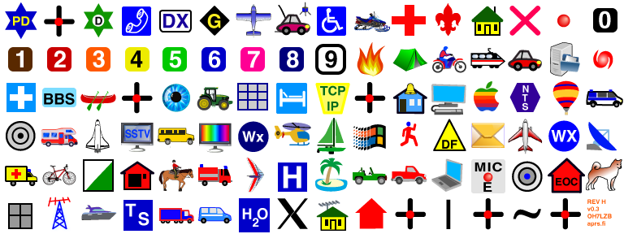

aprs.fi high-resolution symbol set
=====================================

This is a new APRS symbol graphics set, which can be used by any APRS
applications, for free.

Format
--------

The new symbols are drawn in vector format (as opposed to a raster format at
a fixed resolution), allowing them to be rendered at larger and smaller
sizes without distortion or blurriness.  The new symbols are slightly larger
than the old ones, making them easier to recognise on modern displays having
smaller pixels than the old ones.  They can be rendered in high resolution
so that they're properly sharp on the 4K/retina displays found on many
modern tablets, phones and computers!

The symbol set is published in both vector (Adobe Illustrator/PDF) and
raster (PNG) formats.  Raster renderings are available in 24x24, 48x48,
64x64 and 128x128 pixel resolutions - drawing from raster sprites in apps is
usually quicker and easier than working with the vector source material. 
Having the vector sources makes it possible to improve them and and replace
individual symbols easily.  If you need to render other resolutions or make
some other fine tuning, you can run Illustrator for free for 30 days.  The
symbol set release even comes with a little piece of javascript which
crunches out the 3 PNG files (primary, secondary, overlay characters) at the
4 resolutions in a few seconds.  Inkscape can probably open the .ai file,
but some of the effects might not work too well, I have not tried myself. 
The AI file contains some basic Illustrator effects (blur, shadow) which
Inkspace may or may not support.

The PNG files contain an alpha layer, which is used in many symbols for
(partial) transparency.  Make sure that is handled when using the PNGs.

Most symbols in the PNGs contain a little bit more unused space around the
actual symbol, than in the old symbol sets.  The amount of space also varies
slightly too much to my taste.  I will probably work on that later on.

Copyright info
-----------------

Naturally I did not draw all of the symbols myself. Many are loosely or
strongly based on the original symbol graphics, primarily to keep the
familiar and consistent look.  Some symbols I obtained from other sources,
such as Wikipedia.  In those cases I picked SVG versions which allow
commercial reuse (source known, and the work is placed on public domain, or
with a CC license which allows adaptation and commercial reuse).  In any
case, the source and copyright information is documented separately for each
symbol (see [COPYRIGHT](COPYRIGHT.md)).

If you use this symbol set, please provide a pointer to the source
(http://github.com/hessu/aprs-symbols/).

The aprs.fi symbol graphics set does not contain additional symbols for
overlays yet, mostly because it takes lots and lots of time to draw them,
and the effort it took to create this set was pretty high already.  Maybe
later!

Differences to original set
------------------------------

There is one obvious difference in the new symbol set: the "ham store"
symbol has been replaced with a more generic "store" shopping cart,
reflecting the current \h symbol definition in the master index.  Please use
the 'H' overlay character to specify an amateur radio shop.

To complement the symbol graphics, I've previously published a
machine-readable (CSV/JSON/XML/YAML) APRS symbol description index, which is
easier to integrate in applications than Bob's master list.

Heikki Hannikainen
OH7LZB

